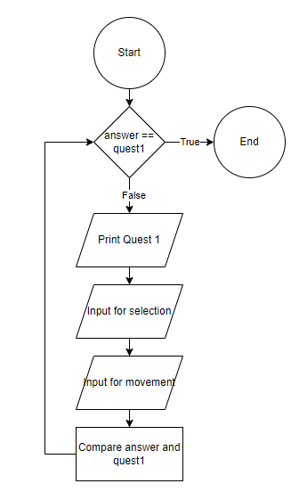

# Intel-System

Arrange the Solah is the children’s prayer sorting game for kids under 5 years old to sort 5 prayers from 1 to 5. We will give them a list of prayers with the wrong order and they need to enter their choice and to where they want to move the location. By doing this, children will have knowledge of the prayers they will do first and the prayers they will do last.
